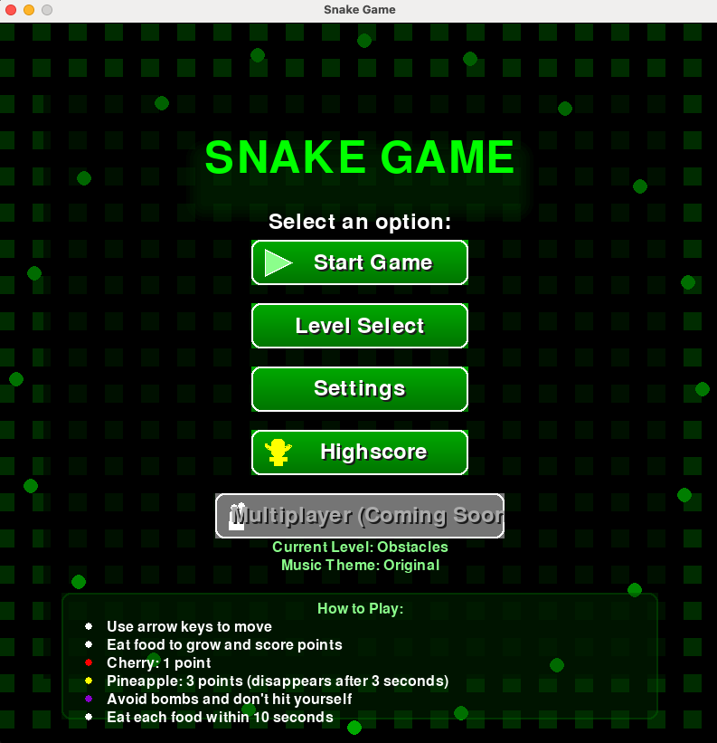
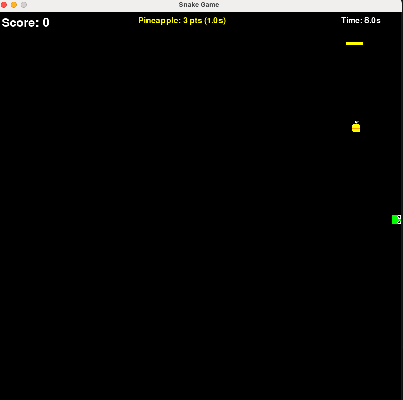
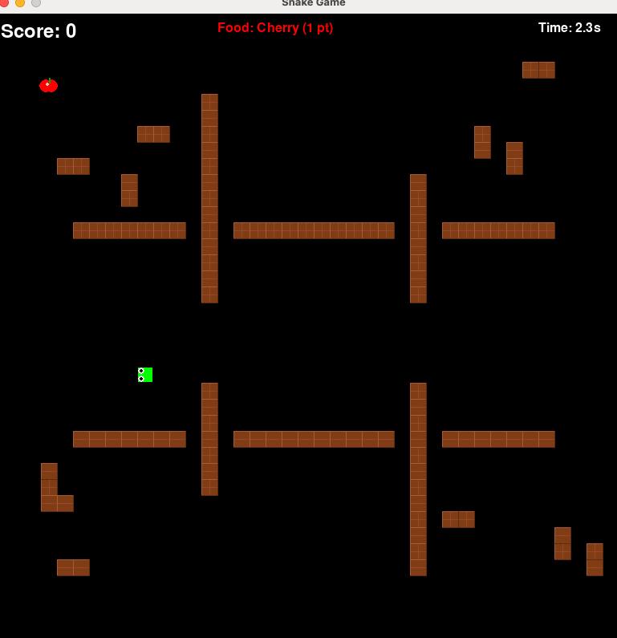
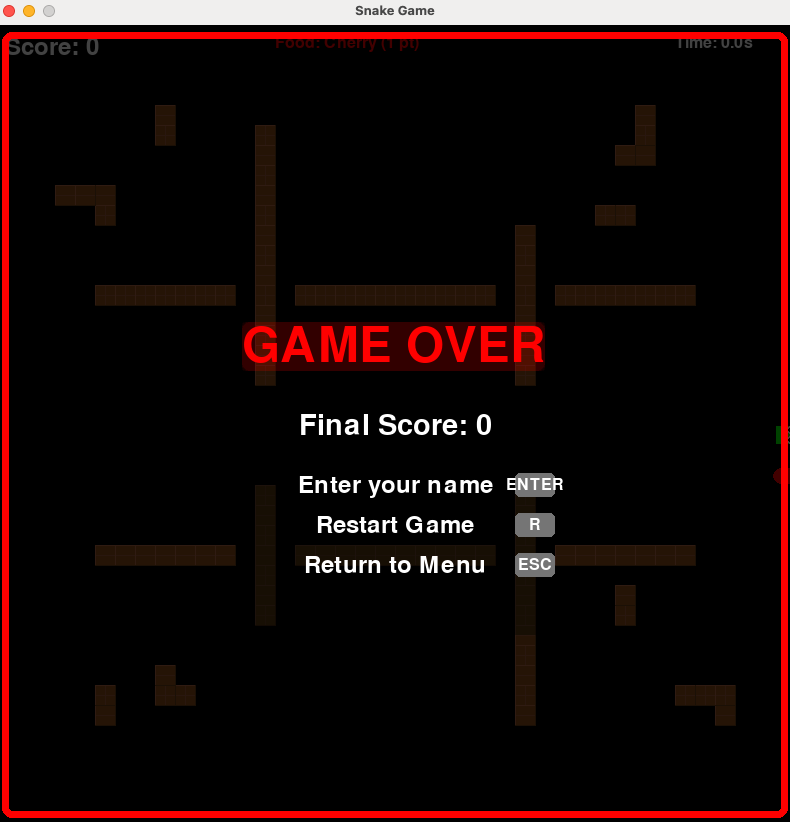

# Snake Game

Early Python/Pygame learning project.

This was one of my first shipped coding experiments. I keep it public because it shows where the path started: a small game, a visible result and a lot of hands-on learning around state, game loops, UI screens, audio and repository structure.

It is not a current flagship project. It is a marker of progress.

## What it includes

- Classic snake gameplay
- Obstacle mode
- Different food types and bomb mechanics
- Pause, reset and menu screens
- High-score handling
- Simple sound effects and background music
- Screenshots for the main game states

## What I practiced

- Structuring a small Python project
- Handling game state with Pygame
- Drawing and updating UI elements
- Managing keyboard input
- Adding audio and visual feedback
- Shipping a complete small project instead of leaving it as a local experiment

## Run locally

```bash
pip install -r requirements.txt
python snake_game.py
```

## Controls

- Arrow keys: move
- `P`: pause or unpause
- `R`: reset
- `ESC`: return to menu

## Screenshots

### Main menu


### Gameplay


### Obstacles


### Game over


## Status

Archived learning project. I am not actively extending it, but I keep it public as part of the visible learning timeline.
